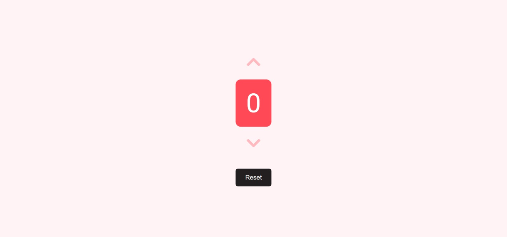

# Simple Counter

## Welcome! 👋

Hello! Thanks for cheking out this repository.

## What is it about

It's a simple counter made with vanilla JS. It's been replicated from [jhon smilga's youtube course](https://youtu.be/3PHXvlpOkf4) with a different UI.

Here is my project site's url-
https://drougnov.github.io/simple-counter/

## Built with

-HTML

-CSS

-Javascript

## Author

Facebook -[Biplob Barua Rocky] https://www.facebook.com/drougnov.bd.9

Frontend Mentor - https://www.frontendmentor.io/profile/Drougnov

### Any suggestion

I would be glad and greatful if you could leave any suggestion for this project or about anything else. Have a good day :)
